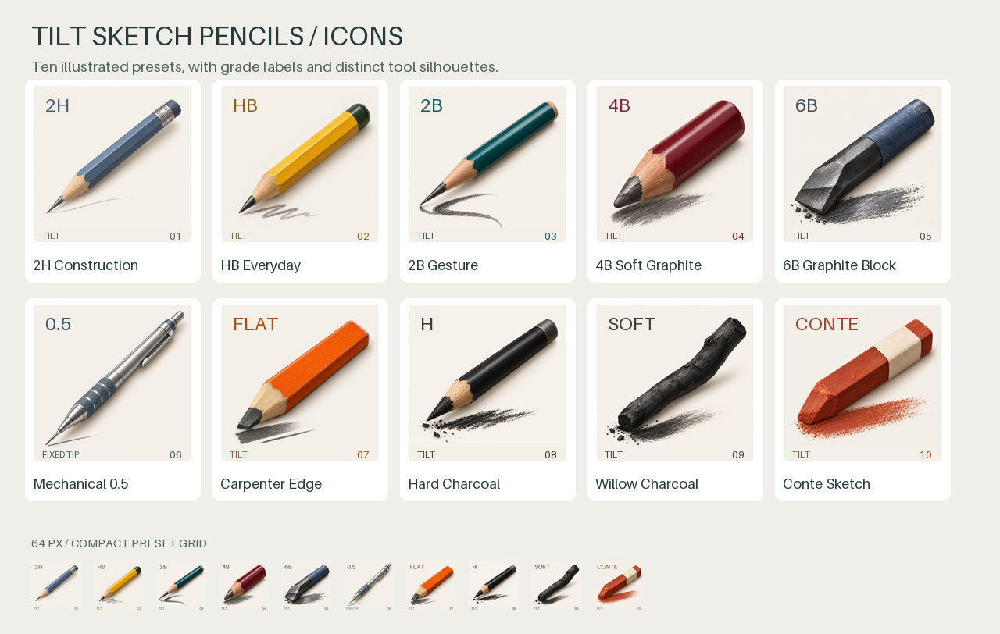
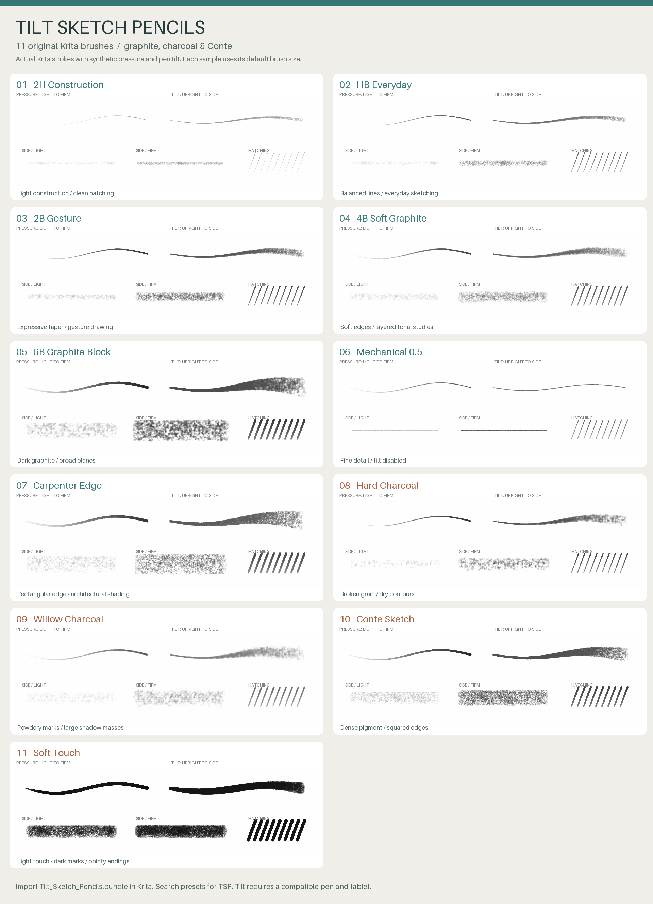

# Tilt Sketch Pencils

Ten original sketching brushes for Krita: five graphite grades, a mechanical pencil,
a carpenter pencil, hard charcoal, willow charcoal, and Conté. Nine brushes use
**pen tilt for width, tip shape, and shading direction**. All ten respond to pressure.

**[Download the latest release](https://github.com/kemicofa/krita/releases/latest)**
and choose `Tilt_Sketch_Pencils.bundle`, or the ZIP for the bundle, preview, and guide.
No compilation, Python installation, or plugin is needed to use the brushes.



Each preset has its own illustrated tool icon, grade label, and number. The release
also includes an **Icons ZIP** with the ten standalone 200 × 200 PNGs.



## Install in Krita

1. Download `Tilt_Sketch_Pencils.bundle`. Leave the `.bundle` file intact.
2. Open **Settings → Manage Resource Libraries… → Import** and select it.
   Depending on your Krita version, resource importing is under **Manage Resources…**.
3. Make sure the library is active. In **Brush Presets**, select **All** and search
   for **TSP**, or select the **Tilt Sketch Pencils** tag. Restart Krita if needed.

When updating an older version, deactivate its library and import the new bundle.
The preset names stay the same. If you saved local copies of the older presets,
those copies retain their old icons; select the presets from the new library.

The pack targets Krita 5.x. It was rendered locally in Krita 5.2.9; every CI build
also loads and renders the pack in the Krita version supplied by Ubuntu 24.04.

## The ten pencils

| Preset | Best use | Pressure and tilt behavior |
| --- | --- | --- |
| **01 · 2H Construction** | Light layouts, guides, precise hatching | Light deposit; a fine point that widens gently into grainy shading |
| **02 · HB Everyday** | General sketching and crosshatching | Balanced darkness and taper; a useful starting pencil |
| **03 · 2B Gesture** | Figure gestures and expressive outlines | Strong pressure taper; broad side shading |
| **04 · 4B Soft Graphite** | Tonal studies and soft modeling | Softer edges, gradual values, velvety tilted strokes |
| **05 · 6B Graphite Block** | Dark accents and broad planes | Dense graphite, chunky shape, coarse paper tooth |
| **06 · Mechanical 0.5** | Small details and consistent hatching | Nearly fixed fine width; pressure changes darkness; tilt disabled |
| **07 · Carpenter Edge** | Architecture and angular forms | Rectangular contact; pen direction selects a narrow edge or broad face |
| **08 · Hard Charcoal** | Dry contours and scratchy shading | Broken grain, firmer edges, strong line-to-side contrast |
| **09 · Willow Charcoal** | Soft shadow masses and atmospheric studies | Powdery deposit, soft edges, the broadest side shading |
| **10 · Conte Sketch** | Dense contours and planar shading | Squared contact and slightly waxy coverage; try a rust-red foreground |

Names such as “0.5” describe the intended drawing feel, not a physical millimeter
width. Pixel sizes vary with the canvas, zoom, pressure, and tilt.

## Get the pencil feel

- Start with **02 HB** for lines, **04 4B** for shading, and **07 Carpenter** or
  **09 Willow** for the strongest flat-side effect.
- Hold the pen upright for fine lines; lower it toward the tablet for broad shading.
  Turn the direction of the tilted pen to change the flat tip's orientation.
- Build value with repeated strokes and pressure. The charcoal brushes deliberately
  retain paper gaps and may look light on the first pass.
- The toolbar size is the maximum tip size. An upright tip is much smaller.
  Scale it up for large canvases; use the delivered size first on a 1500–3000 px canvas.
- All brushes use your foreground color; the charcoal brushes can draw in color too.
- The grain is included in the presets, so a textured background is optional.

**Tilt requires a pen and tablet that report tilt to Krita.** Without tilt input,
the brushes remain in their upright state and still respond to pressure. To obtain
a fixed broad shader on such a device, press **F5**, disable the **Tilt elevation**
sensor under **Size**, disable **Ratio** and **Rotation**, lower the toolbar size
to taste, and save a separate preset.

If tilt appears unresponsive, use Krita's tablet tester to check that X/Y tilt values
change. These are tilt sensors, so an expensive stylus with barrel rotation is not
required. See Krita's [sensor reference](https://docs.krita.org/en/reference_manual/brushes/brush_settings/tablet_sensors.html)
and [rotation and ratio options](https://docs.krita.org/en/reference_manual/brushes/brush_settings/options.html).

## Build from source

Python 3.12 or newer is sufficient for generation; C++ is not involved.

```sh
python3 -m venv .venv
. .venv/bin/activate
python -m pip install -r requirements.txt
python build_brushes.py
python verify_bundle.py
```

The installable file is `dist/Tilt_Sketch_Pencils.bundle`. The `dist/resources/`
directory also contains individual `.kpp` presets, `.gbr` tips, and PNG paper
textures. Each preset embeds its tip and texture to avoid missing dependencies.

`build_brushes.py` contains the ten brush specifications, sensor curves, procedural
coverage masks, and tileable paper textures. The PNG metadata and resource-bundle
layout follow Krita's native formats. All artwork and masks in this pack are original;
no default Krita brush assets are redistributed.

The icon illustrations were generated using the built-in image generator. Original
PNGs and the exact prompt set are checked in under `assets/icons/`. The build resizes
those assets and adds the labels locally; builds do not call an image API.
The marks in the icons are decorative illustrations. The separate brush preview
shows actual strokes rendered by Krita.

To run the same rendering checks as CI, install Krita with Python support and run:

```sh
python tools/run_krita_check.py --python-home /usr
python tools/make_preview.py
python tools/package_release.py
```

That `--python-home` value is for a system Linux installation. For an extracted
AppImage, pass `--krita /path/to/squashfs-root/AppRun` and
`--python-home /path/to/squashfs-root/usr`. Omit `--python-home` when Krita already
locates its embedded Python correctly. On a Linux machine without a display, install
`xvfb` and `xauth` and prefix the rendering-check command with `xvfb-run -a`.
Close other Krita instances before running
the rendering check. The check uses a temporary resource/configuration directory.

The checks verify bundle checksums, embedded dependencies, all ten presets loading,
light/heavy pressure, broadening under tilt, orientation of the flat contact,
and the mechanical pencil's stable width. The preview is rendered by Krita using
synthetic tablet events. **Physical tablet feel has not been tested.**

## CI and releases

Pushes to `main`, pull requests, and manual workflow runs build and validate the pack,
then upload a **Tilt-Sketch-Pencils** workflow artifact retained for 30 days.

To publish a new version:

1. Update `VERSION` and `RELEASE_NOTES.md`, commit, and push to `main`.
2. Wait for the build to pass.
3. Tag that commit with the matching version and push the tag:

   ```sh
   git tag -a v1.1.1 -m "Tilt Sketch Pencils 1.1.1"
   git push origin v1.1.1
   ```

The tag workflow rebuilds and tests the pack before publishing a GitHub release
with the bundle, pack and icon ZIPs, both previews, validation report, brush catalog,
and SHA-256 checksums.
It uses GitHub's built-in token; no additional secrets are required. Existing release
tags should stay attached to their published commits.

The repository's [MIT license](LICENSE) covers the generator and original brush assets.
Artwork drawn using the brushes belongs to its creator.
